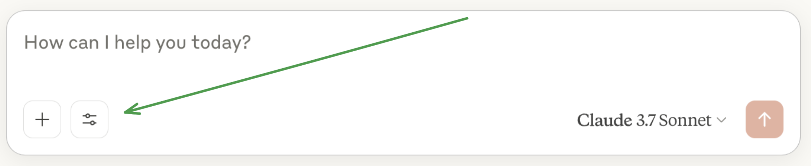
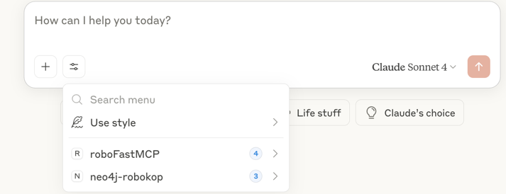

# ROBOMCP

## MCP Client/Server for ROBOKOP

Multi-Component Protocol (MCP) agent for querying ROBOKOP endpoints [here](https://robokop-automat.apps.renci.org/) using OpenAI agents and MCP servers that call structured tools.

---

## Available Tools

| Tool                                                      | Description                                                                            |
|-----------------------------------------------------------|----------------------------------------------------------------------------------------|
| `get_normalized_curie(text)`                              | Converts a biomedical name to a normalized CURIE.                                     |
| `get_current_nodes(curie)`                                | Retrieves detailed node info from ROBOKOP.                                            |
| `get_current_edges(curie, category=None, predicate=None)` | Fetches edges connected to a node, optionally filtered by category or predicate.      |
| `get_edge_summary(curie)`                                 | Returns a summary of all predicates and connected node types + counts for a given node.|

---

## Example Queries

- What diseases are treated by Metformin?  
- Show me nodes related to MONDO:0005148  
- What types of relationships are connected to NCBIGene:19?  
- What drugs treat MONDO:0005148?  
- Tell me more about the node MONDO:0005148 and MONDO:0004979  
- How many diseases is ABCA1 related to? List those diseases.  
- What is the CURIE ID for Alzheimer Disease?  
- What are the various kinds of edges connected to CHEBI:135285?

---

## Running on Claude Desktop

1. Open `claude_desktop_config.json` located at  
   `~/Library/Application\ Support/Claude/claude_desktop_config.json` in any text editor.  
   - If it doesn't exist, create it manually.
2. Edit the file to include the appropriate path to your `robokop_mcp_server.py`.
3. Save the file and restart Claude Desktop.
4. Once restarted, you should see available servers and tools under each server.
5. You can expand each tool using the arrows.

  


---

## Other Agents

1. **Clone the Repository:**

```bash
git clone https://github.com/RobokopU24/ROBOMCP.git
cd ROBOMCP
````

2. **Set Up the Environment:**

```bash
uv venv
source .venv/bin/activate

# Install dependencies from requirements
uv pip install -r requirements.txt
```

3. **Create a `.env` File:**

### Running with OpenAI
1.  Add to the `.env` File: 
```dotenv
OPENAI_API_KEY=your_openai_key_here
```

2. Run the Client, specifying the provider:

```bash
 python robokop_mcp_client.py --provider openai
```

### Running with ollama-based model
1. Run the Client, specifying the provider:

```bash
 python robokop_mcp_client.py --provider ollama
```
- example ollama model:
    - llama3.2 (default)
    - qwen3:latest  
    - mistral:latest
    * remember to do this in the terminal: ollama pull (the model you chose eg qwen3:latest)
---

## Notes

* Ensure the dependencies are installed and `.env` is set before running `python robokop_mcp_client.py --provider openai` option.

---

## Development Notes

* **Tools:**

  * Defined using `@mcp.tool()` decorators in `robokop_mcp_server.py`.
  * Registered with the MCP agent in the same file.

* **MCP Server:**

  * MCP servers are launched from the client.

## Robokop Neo4j-Servers tools

We enabled [Neo4j](https://github.com/neo4j-contrib/mcp-neo4j/tree/main/servers/mcp-neo4j-cypher)-backed tools in RobokopMCP. To run:

1. Run ```uv pip install mcp-neo4j-cypher``` to install the dependency
2. Use the ```.env``` to set your neo4j password. eg\
   ```NEO4J_PASSWORD=hereisasamplepasswordlineina.envfile```
3. Run this in the terminal:
```bash
python robokop_mcp_client.py \
  --provider openai \
  --server mcp-neo4j-cypher \
  --neo4j-uri bolt://robokopkg.renci.org:7687 \
  --neo4j-db neo4j
```

